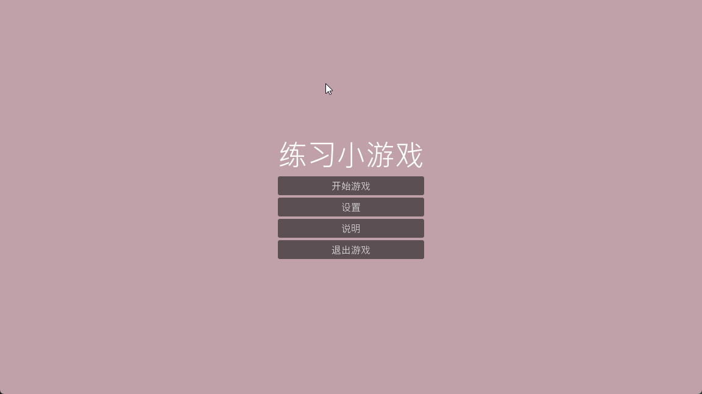
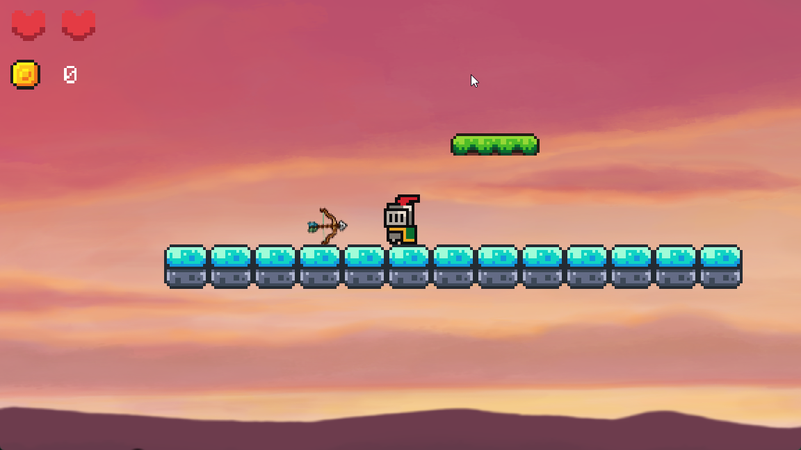
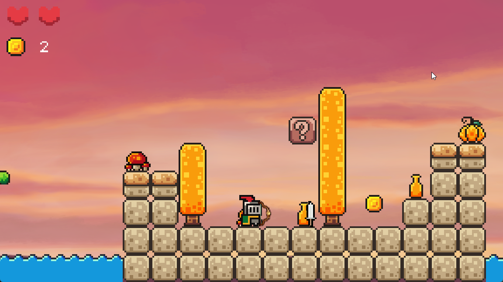
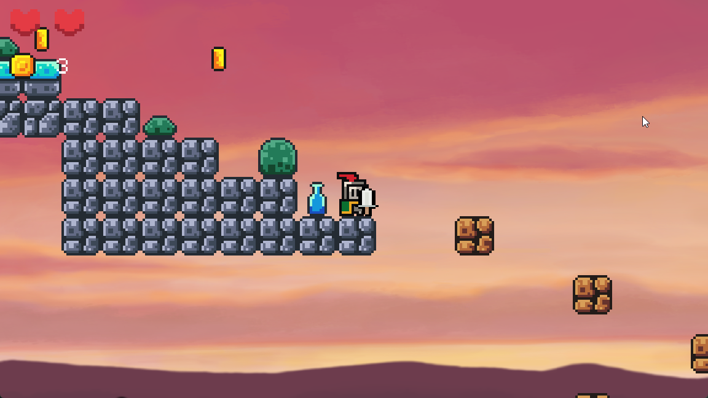
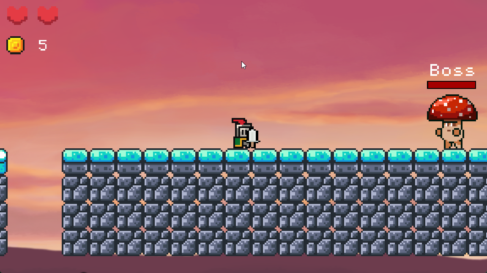
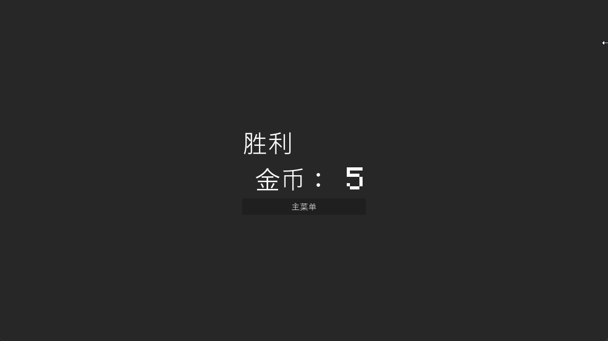

🎮 My First Godot Game (C#)

这是我使用 Godot 4 + C# 完成的第一个练习小游戏。
在学习过程中，我特别感谢 Brackeys 的 Godot 教程，内容清晰、通俗易懂，帮我顺利完成了这个项目的雏形。

Youtube：https://www.youtube.com/@Brackeys

本项目在教程基础上进行了扩展，添加了多个场景、武器系统、敌人逻辑、Boss 战等内容，作为初学者的完整练习项目，希望能对其他初学者有所帮助。

📸 游戏截图

🧩 游戏功能（Features）
✔ 多场景流程

游戏包含以下 5 个场景，使流程更加完整：

开始菜单（Start）

设置（Settings）

暂停（Pause）

说明（explanation）

结算（Game Over）

✔ 完整的玩家操作

移动 / 跳跃

踩踏敌人

使用两种不同类型的武器

✔ 两类武器系统
1. 🔪 短程武器：匕首

高伤害

攻击距离短

2. 🏹 远程武器：弓箭

低伤害

攻击距离远

🎁 武器掉落机制

小怪死亡后随机掉落武器

如果玩家已经持有某武器，则不会重复获得

玩家最多可装备 两把武器

✔ 两种特殊砖块

踩上后会掉落的砖块

从下方顶击可获得金币的砖块

✔ Boss 战

击败 BOSS 后游戏结束。

👾 敌人系统（Enemies）

所有敌人的逻辑继承自 BaseEnemy（C#）

虽然部分逻辑还可以优化，但作为练习实现了基础 AI：

巡逻、追击、受伤、死亡、掉落物品

👤 玩家逻辑（Player）

作为第一个游戏项目，玩家逻辑实现了完整功能但仍有优化空间，包括：

状态管理

输入处理

武器切换

受伤反馈

动画播放

未来有时间会进行进一步重构。

🛠 技术栈（Tech Stack）

Godot 4.5.1

C#（Mono）脚本

Godot 内建物理系统与动画系统

场景树管理游戏模块

📂 项目结构（示例）
project/
 ├── scenes/
 ├── scripts/
 ├── assets/
 └── README.md

📝 总结

这是我第一次用 Godot + C# 做的完整游戏练习，重点在于熟悉：

Godot 引擎流程

C# 脚本

场景管理

玩家与敌人交互

简单武器系统

项目仍有很多优化空间，但我希望它能作为一个良好的入门示例，帮助其他 Godot 初学者。

可执行文件下载地址：https://github.com/zebra1binbin/godot_littlegame/releases/tag/V1